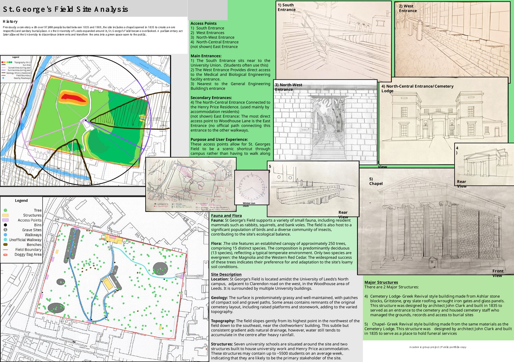

# St. George's Field Site Analysis

## Project overview

An academic group study of St. George's Field at the University of Leeds. The work established design constraints and opportunities before later concept development.

## Areas assessed

- Site history and heritage structures
- Pedestrian access and circulation
- Topography and likely drainage behaviour
- Existing buildings and key stakeholders
- Trees, ecology and landscape character
- Sun path, boundaries and informal site use

The board combines mapping, annotated observations and hand-drawn studies of entrances, the cemetery lodge and chapel.

## Evidence

- [Site-analysis board](St-Georges-Field-Site-Analysis.pdf)

> This was a group submission and is included as evidence of collaborative site-analysis work.

