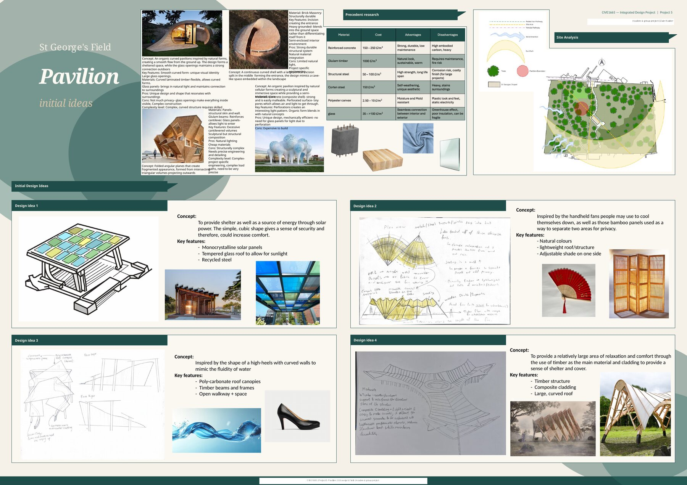
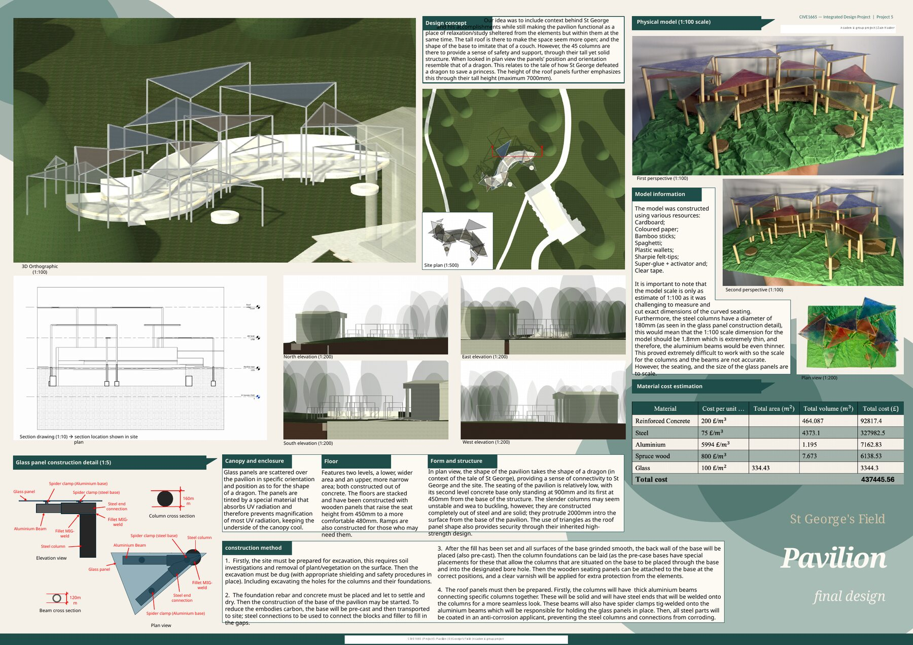

# St. George's Field Pavilion

## Project overview

An academic group project to develop a pavilion for St. George's Field at the University of Leeds. The brief combined site response, shelter, accessibility, material choice, buildability and architectural character.

## Work shown

- Site and precedent research
- Four initial concept directions and comparative material considerations
- Development of a pavilion concept inspired by the story of St. George and the dragon
- 3D visualisation, plans, elevations and a section
- A 1:100 physical model
- Construction details, sequence and material-cost estimate

The final proposal uses a raised, accessible form with steel columns, aluminium framing and patterned glass roof panels. Seating and sheltered study space are integrated into the layout.

## Evidence

- [Initial and final design boards](Pavilion-Design-Boards.pdf)

> This was a group submission and is included as evidence of collaborative design work.

