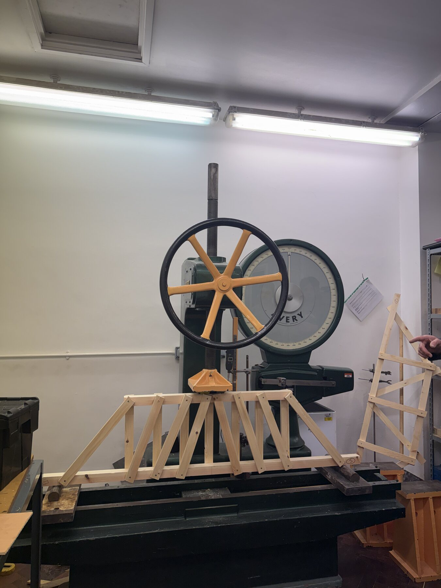
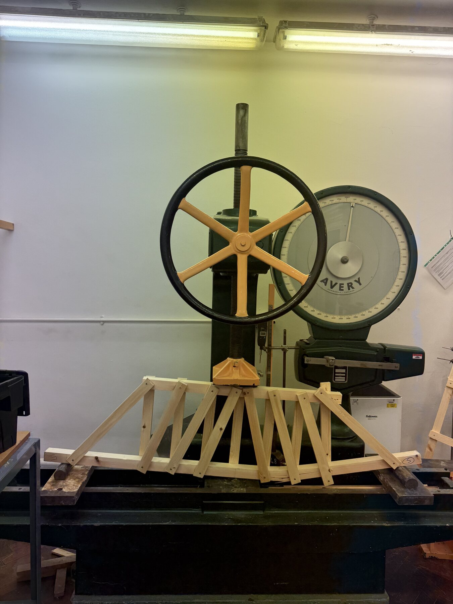
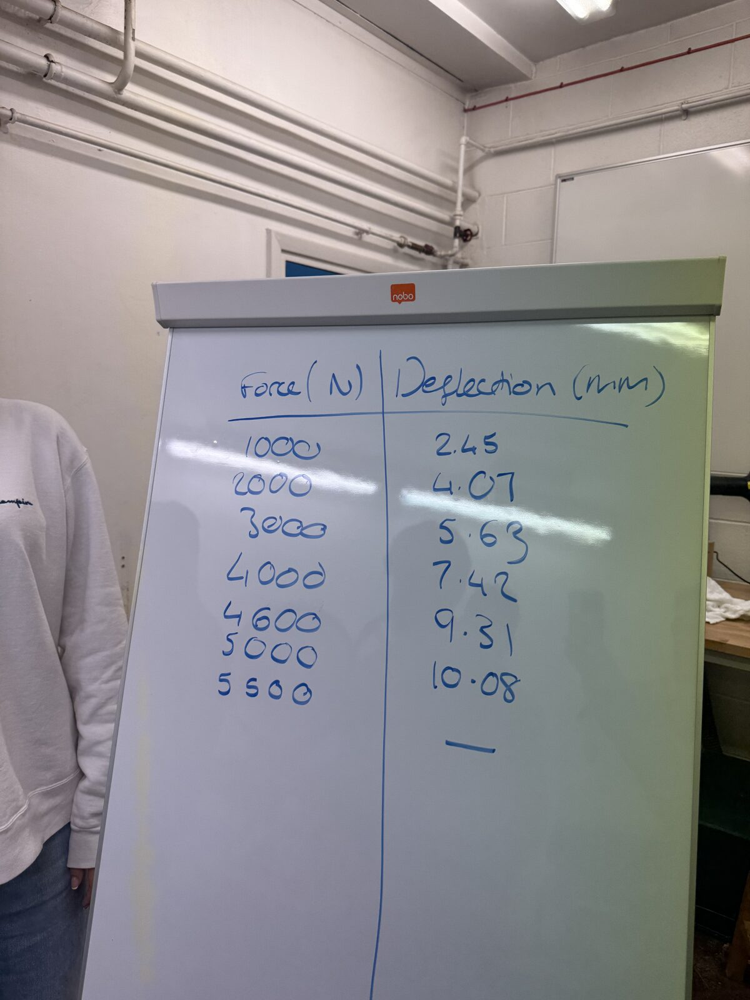
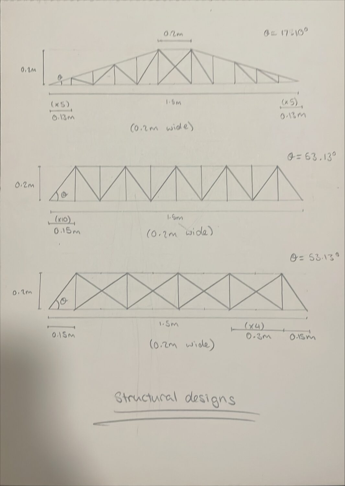

# Timber Truss: Design, Build and Test

## Project overview

An academic structural-engineering exercise to design, construct and test a scaled timber truss for a proposed replacement superstructure. The design sought to carry the required load while using material efficiently and controlling cost.

## Engineering process

- Developed and compared alternative truss arrangements.
- Calculated member forces and assessed tension, compression and buckling capacity.
- Selected timber sections and estimated a model cost of approximately £262.80.
- Built a 1.5 m physical model and tested it under incremental central loading.
- Recorded mid-span deflection and compared experimental behaviour with predictions.
- Identified the bottom-chord glued connection as the governing detail.

## Result

The truss carried the design load and reached an ultimate test load of approximately **5.25 kN**. Failure occurred at the central glued joint of the bottom chord, matching the predicted critical location. No timber-member fracture or buckling was observed.

## Evidence

- [Technical report](Timber-Truss-Design-Build-Test-Report.pdf)

