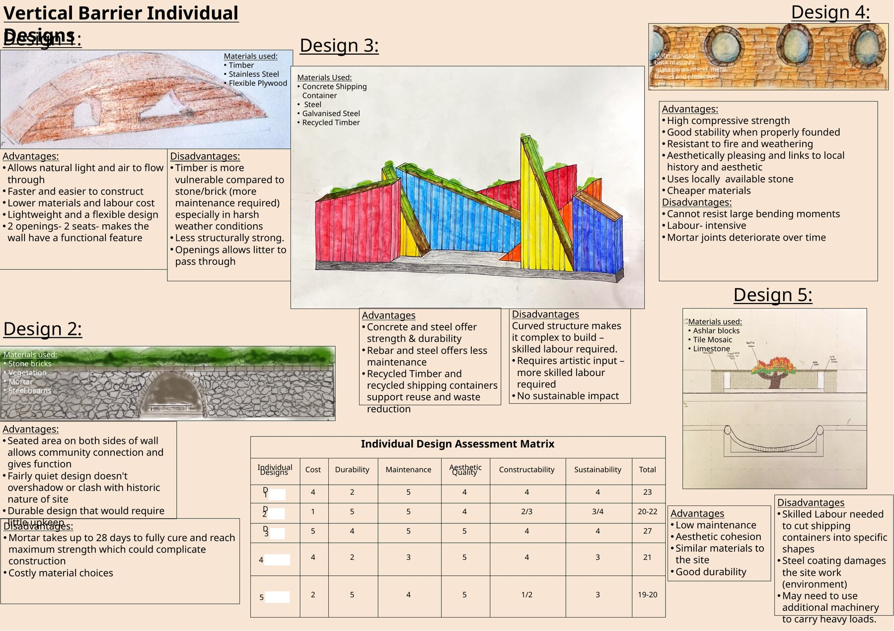
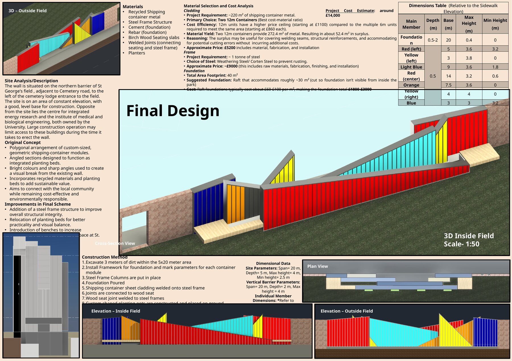

# Vertical Barrier

## Project overview

An academic group project to replace or reinterpret a northern boundary at St. George's Field. The proposal was assessed against cost, durability, maintenance, aesthetics, constructability and sustainability.

## My contribution and team development

My initial proposal is shown as **Design 1** on the concept-comparison board. It explored a lightweight timber and stainless-steel barrier with openings for light, ventilation and integrated seating. The team then compared five concepts and developed the final scheme collaboratively.

## Final scheme

- Recycled shipping-container cladding on a weathering-steel frame
- Integrated seating and planting
- Raft-foundation concept and an indicative construction sequence
- Plans, elevations, section and 3D visualisations
- Material and cost analysis with an indicative project estimate of approximately £14,000

## Evidence

- [Concept comparison and final design boards](Vertical-Barrier-Design-Boards.pdf)

> This was a group submission. The individual concept attributed above is identified in the original assessment matrix.

